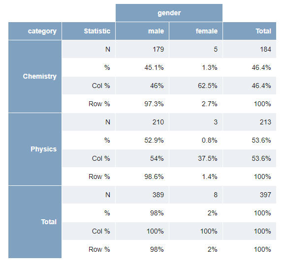

# flexpivot

> [{flextable}](https://github.com/davidgohel/flextable) extension to create ready-to-use frequency tables in [shiny](https://shiny.posit.co/) and [rmarkdown](https://rmarkdown.rstudio.com/), and easily exportable to Word, PowerPoint and Excel.

<!-- badges: start -->
[](https://lifecycle.r-lib.org/articles/stages.html)
[](https://github.com/dreamRs/flexpivot/actions/workflows/R-CMD-check.yaml)
[](https://app.codecov.io/gh/dreamRs/flexpivot?branch=master)
<!-- badges: end -->


## Installation

You can install the development version of {flexpivot} from GitHub with:

```r
remotes::install_github("dreamRs/flexpivot")
```

## Example

```r
library(flexpivot)
library(magrittr)

nobel_laureates %>%
  subset(category %in% c("Chemistry", "Physics")) %>% 
  pivot_table("category", "gender") %>%
  pivot_format()
```




More examples available in the vignette : https://dreamrs.github.io/flexpivot/articles/flexpivot.html


## Related packages

* [crosstable](https://github.com/DanChaltiel/crosstable) & [crosstableAssistant](https://github.com/DanChaltiel/crosstableAssistant) makes it easy to calculate descriptive statistics and export them into Office and has a nice Shiny app to create tables interactively.


