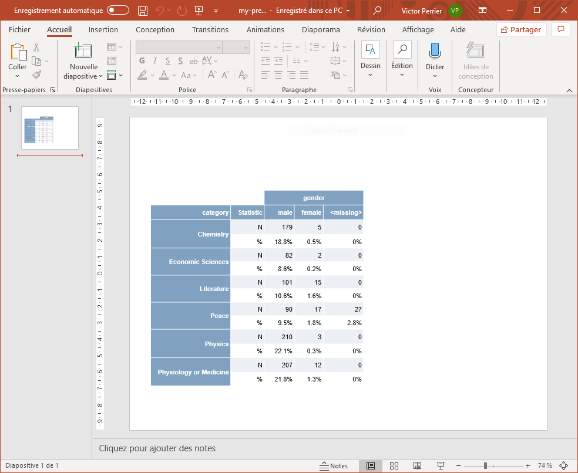
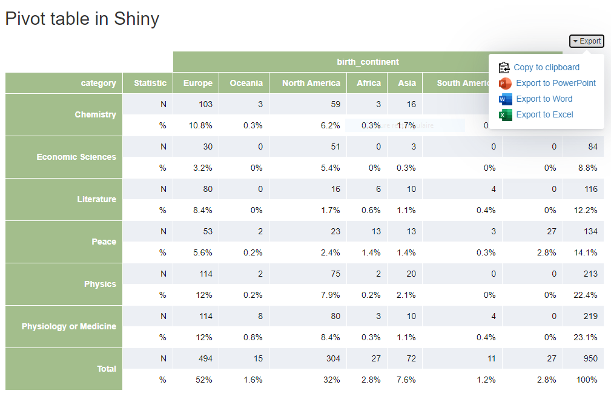

```{r, include = FALSE}
knitr::opts_chunk$set(
  collapse = TRUE,
  comment = "#>"
)
```

```{r setup}
library(flexpivot)
library(magrittr)
```


Create contingency tables ready to be used in [shiny](https://shiny.rstudio.com/) and [rmarkdown](https://rmarkdown.rstudio.com/), and to be exported to Microsoft Office products via package [officer](https://davidgohel.github.io/officer/).

## Usage

Get count and percentage with one variable:

```{r row-example}
nobel_laureates %>%
  pivot_table("category") %>%
  pivot_format()
```


Add a second variable as row or col :

```{r row-col-example}
nobel_laureates %>%
  pivot_table("category", "gender") %>%
  pivot_format()
```

```{r two-rows-example}
nobel_laureates %>%
  pivot_table(c("category", "gender"), total = FALSE) %>%
  pivot_format()
```


## Customize

Change color and labels :

```{r custom-example}
nobel_laureates %>%
  pivot_table("category") %>%
  pivot_format(
    background = "#D8DEE9",
    color = "#3B4252",
    labels = pivot_labels(
      n = "Count",
      p = "Percentage",
      rows = "Nobel category"
    )
  )
```


## Export

Export pivot table to Word, PowerPoint or Excel:


```{r export-example, eval=FALSE}
pt <- pivot_table(
  data = nobel_laureates,
  "category", "gender", 
  total = FALSE,
  stats = c("n", "p")
)

# PowerPoint
export_pptx(pt, "my-presentation.pptx")

# Word
export_docx(pt, "my-document.docx")

# Excel
export_xlsx(pt, "my-workbook.xlsx")
```

</img>


## Shiny

Use in shiny with `pivotOutput()` and `renderPivot()`, a menu is automatically added to export the pivot table (can be disabled or allow specific export to):


```{r shiny-example, eval=FALSE}
library(shiny)
library(flexpivot)
data("nobel_laureates")

ui <- fluidPage(
  tags$h2("Pivot table in Shiny"),
  pivotOutput("pivot")
)

server <- function(input, output, session) {
  
  output$pivot <- renderPivot({
    pivot_table(nobel_laureates, "category", "birth_continent", stats = c("n", "p"))
  }, background = "#A3BE8C")
  
}

shinyApp(ui, server)

```

</img>


